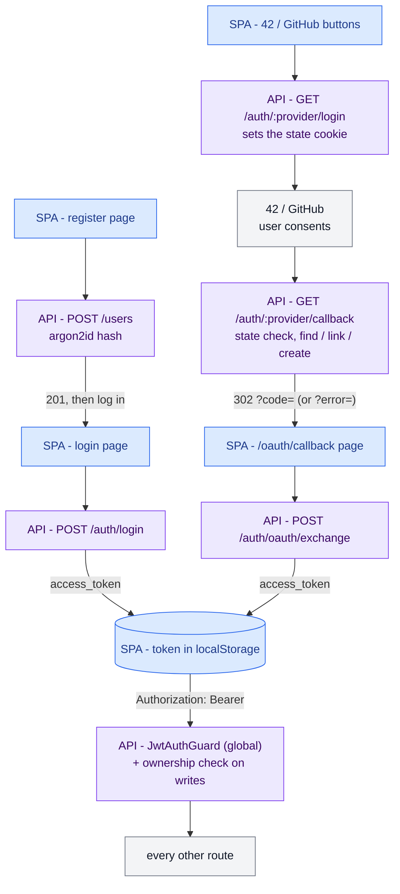
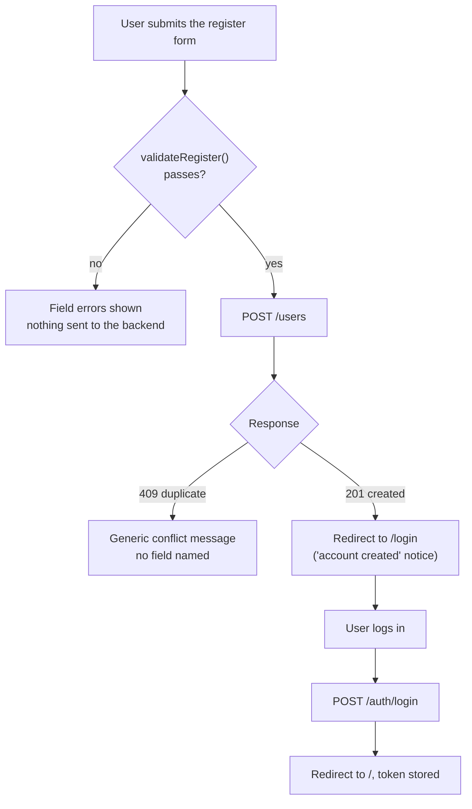
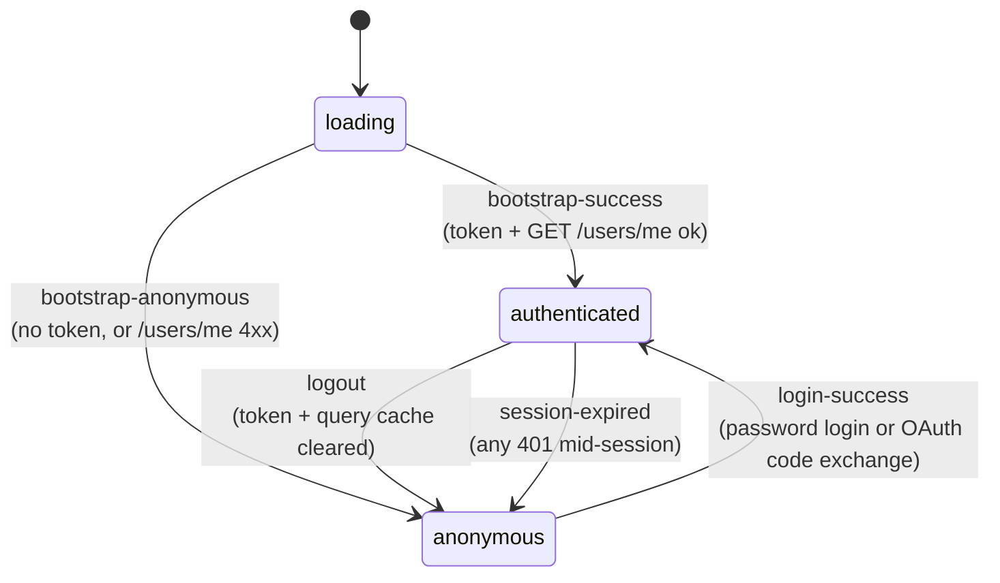
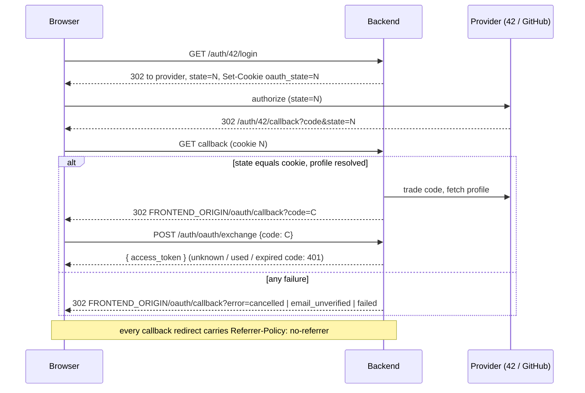
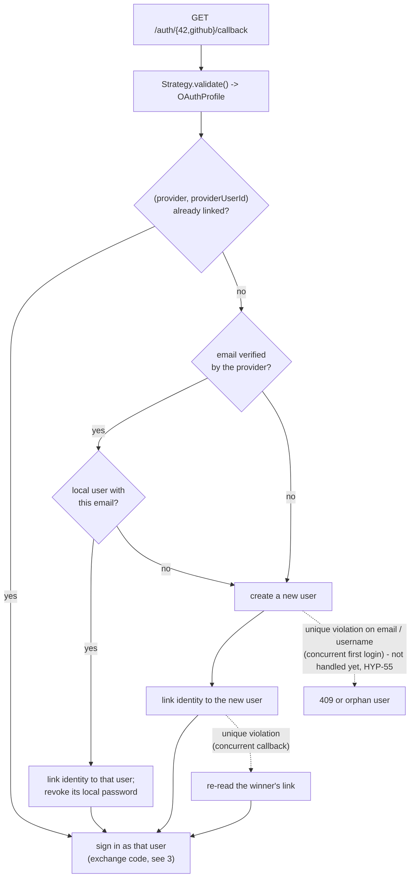
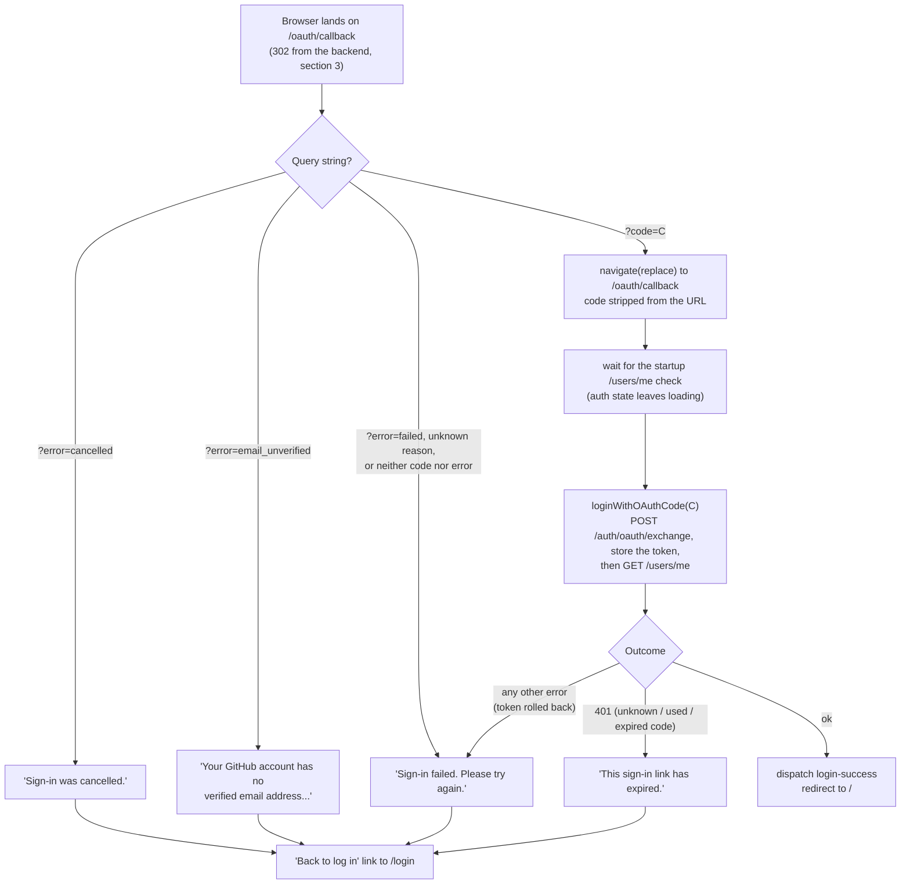

# Auth domain

How an account is created, how a browser gets a token (password or 42 /
GitHub), and how that token guards every other route. Start with the
overview, then open the detail that matches the code you are touching.

Decisions behind it: [ADR-0001](../adr/0001-hash-passwords-with-argon2id.md)
/ [ADR-0004](../adr/0004-pin-argon2id-cost-parameters.md) (argon2id),
[ADR-0002](../adr/0002-jwt-bearer-tokens-for-authentication.md) (JWT bearer),
[ADR-0006](../adr/0006-frontend-architecture.md) (frontend state),
[ADR-0007](../adr/0007-oauth-identity-linking-and-second-provider.md) (OAuth).
The backend legs are also drawn as one poster in
[`auth-flow.png`](auth-flow.png) (Excalidraw source next to it).

## Overview

Blue: the SPA (`frontend/src/features/auth`). Violet: the backend
(`backend/src/auth`, `backend/src/users`). Grey: outside both.

What the overview hides, each covered below or in the ADRs: rate limits
(`security-checklist.md` section 7), the uniform 401 on login, the 403 on
another user's row, the SPA's session states and `RequireAuth` (section 2).

## 1. Register, frontend side (HYP-46)

The SPA never logs in on its own after a registration: a fresh account
always goes through the real login once.

## 2. Session states in the SPA (HYP-45)

`authReducer` (`auth-reducer.ts`): three states, five events. The events
that land on the same state stay distinct so a feature can react to the
cause (e.g. a "session expired" notice).

`RequireAuth` renders nothing while `loading`, its children when
`authenticated`, and redirects to `/login` when `anonymous`.

## 3. OAuth handshake (HYP-11, HYP-53, HYP-57)

The JWT never appears in a URL: the callback hands the SPA a single-use
code, traded for the token by a `POST`.

## 4. OAuth identity linking (HYP-11)

`AuthService.resolveOAuthUser`: which local account a provider identity
signs into.

## 5. OAuth callback page, frontend side (HYP-57)

`auth-oauth-callback-page.tsx`: where section 3 hands the browser back to
the SPA. The code is removed from the URL before it is exchanged, and only
one exchange runs even under StrictMode's double effect. The exchange waits
for the startup `/users/me` check: with a stale token in storage, its late
401 would otherwise wipe the fresh token. A success goes
through the same `login-success` event as a password login (section 2).

The page also sets `<meta name="referrer" content="no-referrer">`, and
the error messages all go through `describeOAuthError`, ready for i18n.
